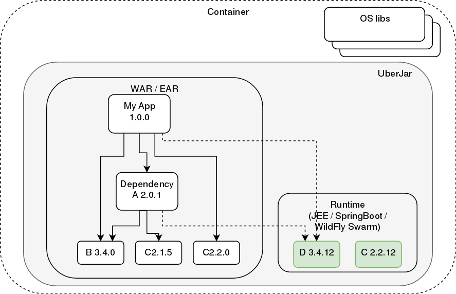

Providing Long Term Support for your products
=============================================

.footnote[
Matej Lazar
- OpenBlend, RedHat
- https://github.com/matejonnet/
- matejonnet@gmail.com
]

???

Visit [http://matejonnet.github.io/presentations/providing-lts-for-your-products/](http://matejonnet.github.io/presentations/providing-lts-for-your-products/) to see slides in presentation mode.

---

Agenda
======

### - When we speak of LST

### - Security bottom UP

### - Use case

### - Application level security

### - Maintainance Risk

### - Improving maintainability

### - Microservices

### - Conclusion

---

When we speak of LST
==================
- Supported product
- Being able to fix the bugs and ecurity exploits
- Usualy no active development

---

Security bottom UP
==================
- OS (keep it updated)
- App server
- Frameworks / Custom Libraries
    - eager to pick any
    - Potentially use native components
- Our Application
- Containerized application (Docker like images)

CVE lists (eg. https://nvd.nist.gov/)

---

Use case
========

[Example schema @ draw.io](https://www.draw.io/?lightbox=1&highlight=0000ff&layers=1&nav=1&title=dependency-example.xml#R7VpRc%2BI2EP41zLQvjCXZGB4DR65zcze9OaaT3qPAilHPWK4QAe7XV7IljC3bQDBu0kImibRar6X9vl2tbHpostp95DhZfmEBiXrQCXY99KEH4RD48q8S7DOBC2AmCDkNMhHIBTP6k2iho6UbGpB1QVEwFgmaFIULFsdkIQoyzDnbFtWeWVS8a4JDYglmCxzZ0icaiKVelufk8t8IDZfmzsDRI3O8%2BBFyton1%2FXoQPaefbHiFjS2tv17igG2PRGjaQxPOmMhaq92ERMq1xm3ZdY81o2iQmX3B0UYvRbpIYBoTbqbOSSzOsQVHlq1J0dZa7I3D5DoS1SQ7aXucOoAoO0D2lmIV6eZ2SQWZJXihdLeSOlIW4PXyoPtMo2jCIsZTs8Z3aBxyHFA5cTMWs1iaGOOIhrHsLuSQnBUavxAuqMTxQQ8Ipm5hL%2F3gKKlPdkega198JGxFBN9LFTNqINaUNlzY5vzwRlq2POIGGmoh1pwMD6Zz58uG9n8Nrq6FRZsQHHtde7bG4dX%2BtWBYMk5%2FKrKYu0Z4TqKvbE0FZZWAfS4prGgQqJW1gp3nFrHzRxZ2AFVg57otQIc6g%2B6MgHmn%2BKEifoMu8YMWfr%2FPZD%2Bi8%2FUdyEuBhKUk2iGQNo49OIgUTgF9Uba176T07w1L8UsncOjKVqj%2B%2FzEn%2FBOWe%2BAAr5TT4%2Fk622S67jtmAXNu5mYk0hnpqoz0djz11M9JQmaubJWPa8HZD3I0lUH6aWu7L6WcQ%2F94v6%2BiKhy1sd97Fln5JhZ0RS6t4swUjyx9M5Yq%2BPPLp%2Bk0HXiUf2cJp3E4VsWoEdlXPNEoeIyU52ZbzFe%2F3rgu6T7vWTxz0k81z7xLeeYOijxDjs0zMKzgGXBgCzwDdo0vu7AP%2B%2BbEdpOsEXhkGLhvA84hnKO6tHExnF4ZzgG04BxUnRLa2OCQhRgJ5LFWdxkXSxayGEfTXHqEolNEkeyo%2BFOJ%2B76nu9%2FNUCxnlo1Bz%2FS%2FaxN%2FESH2%2BkSPN4JJUX7nz0zhmxopHPvqXb9mG77Qq9E%2BEpiHxGRb7V610EZ8OImwoC%2FF832Vt9NLHzjH%2ByOFhNFYrI8sf1WCHHYESrC7sJiVS%2FruyGvSl41sBjnuh6WcRwW3VSrkeHcJN%2FDeDd7mlFCHt9esfz3ednErfx3Ud%2B95%2FHXb8vDfy%2BPIt8B8evh2KMGmqv1%2FevZjoVYFbn0hX9qRQcWDO1hVYB3wvQZLu77CSWKvobmGtx%2F%2BfSAJkRDHC7XQh7Ric%2FrghoH%2BHh5HgBq61FLj8AzXZGUfWdSoYoY7up4YdoyPdcJ27jBeCKPzylzdQnwPW62zDiV3Q8Xtv7oEq3X1iRrbfxMlFyzvyCdKbOjetsSueDsmD819zyLEPXqbo9cv4dRh9AI71946fDuP3tHbiN5RKXq95uhFjtekf3X0gsF%2FDPmqw7LbNvRnx5V%2FG%2B%2FCsnvPdWETDK927232RSsUQKlKRT4smsjmpK%2FKQbo4REsHJXgiRCFq1L8%2BRO13IF%2FS4446QJXfQgB5%2FrkXzpduvaWvRQDDrBPnH6%2BNrbeyfoJ3EC8FEZXTQ4f1E7xR%2FdT0xqH7bRS8jRIKOZflZzRsNT%2FLbv61xEw9%2F%2Bonmv4D)

---

Application level security
==========================
- Our bugs
- Public CVE in dependencies
- Which libraries are used in our applications
- Choosing the right runtime environment (lts)
- Dependency managers
    - Maven (provided vs. runtime)
- Dependency repositories
    - Maven Central
    - User’s Github scm repositories (npm)

---

Maintainance Risk
=================
- Knowlage (how)
    - Know how to fix
    - Know how to rebuild/redeploy a product (what is a build script)
    - New team (logs, tracking records, documentation)
    - Know what is used in the application / service
	- Are the dependencies still available
- Environment (where)
    - New (build) servers
    - Miss some system library
    - Missing public/private repositories
    - Which environment is required (Java/maven version, native libs)

---

Improving maintainability - Logical
=========================
- Minimize number of different libraries (see use case)
    - Use provided
    - Align versions cross products
- Keep record of used libraries
    - Monitor for CVE
- Supported dependencies
    - Slow releases
    - Costs
- Use Maven BOM / shared parent
- Automatic alignment

---

Improving maintainability - System
=========================
- Build on the CI (Jenkins etc.)
    - stored configuration
    - Store all build results (logs, workspace)
- Use local repository manager (proxy)
- Well defined Build environment (tooling and versions)
- DB for product and dependecy relations

---

Containerised applications and Microservices
========================
- Spring Boot / WildFly Swarm
    - Many more applications
    - Needs OS update
    - AppServer update
    - And our application update
        - Rebuild all the images

---

Project Newcastle
=================
- Build in clean and isolated environment
    - Preinstalled required Installed tolling
- Keep track of all downloaded dependencies and store them
- Maven repository manager
    - Proxy (store public artifacts)
    - Hosting (our builds)
- Npm registry
    - Proxy (store public artifacts)
    - Hosting (our builds)
- Http proxy

---

3 levels of LTS
===============
1. Know for all the runtime dependencies used in production
2. Have runtime libs sources and compile time dependencies
3. Know how to rebuild all runtime libs

---

Thanks
======

### Project Newcastle
- [https://github.com/project-ncl/pnc](https://github.com/project-ncl/pnc)

### Presentation tool used
- https://github.com/gnab/remark/

### Questions
- matejonnet@gmail.com
